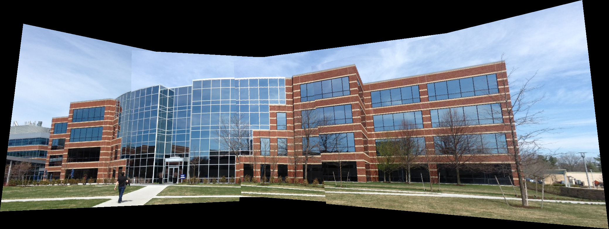
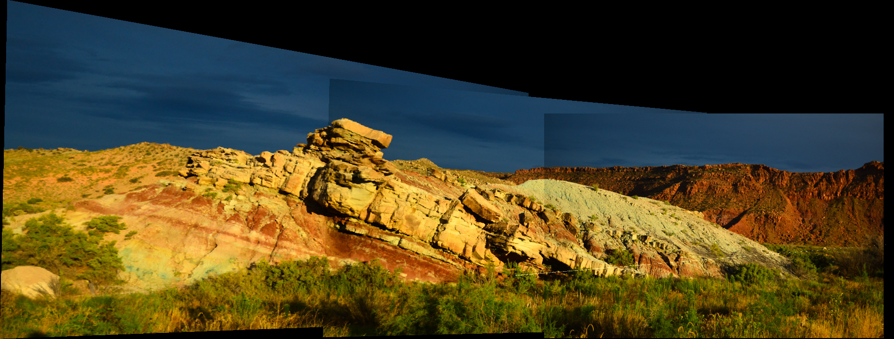
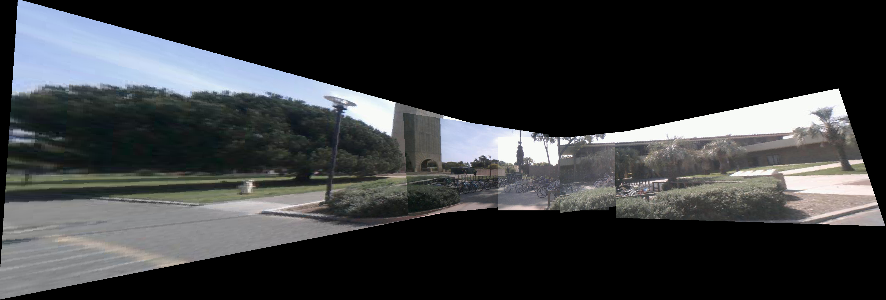
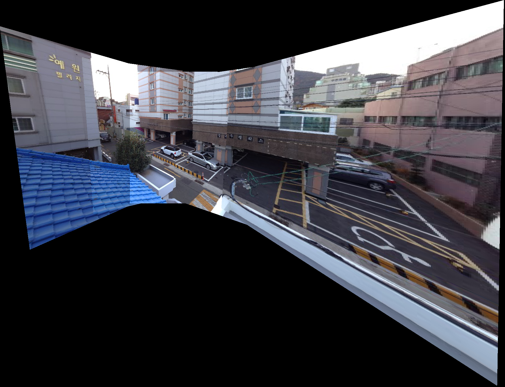

# Panorama from multiple images

Based on this tutorial : [Feature Based Panoramic Image Stitching](https://www.mathworks.com/help/vision/examples/feature-based-panoramic-image-stitching.html)

### Demo:

### Requirements : 

- Python 3.x
- Numpy
- skimage
- matplotlib

### Project Structure : 
	
		|_ panorama.py
		|_ report.pdf
		|	
		|_ images - |
		|			|_ B
		|			|			|- building1.jpg
		|			|			|- building2.jpg
		|			|			|- building3.jpg
		|			|			|- building4.jpg
		|			|			|- building5.jpg
		|			|_ H
		|			|			|- H1.jpg
		|			|			|- H2.jpg
		|			|			|- H3.jpg
		|			|.....etc.....

### To run : 

    `python3 panorama.py -i <path to images dir> -o <path to output dir>`

## Outputs !! 

 
<caption>Stitching with Building example</caption>
  
 
<caption>Stitching with rocky Hill example</caption>
  
 
<caption>Stitching with Park example</caption>
  
 
<caption>Stitching using Parking lot example</caption>
  
 
<caption>Stitching using Temple example</caption>
 

### References : 
[1] https://www.mathworks.com/help/vision/examples/feature-based-panoramic-image-stitching.html

[2] https://github.com/scikit-image/skimage-tutorials/blob/master/lectures/solutions/adv3_panorama-stitching-solution.ipynb

[3] http://ppwwyyxx.com/2016/How-to-Write-a-Panorama-Stitcher/
